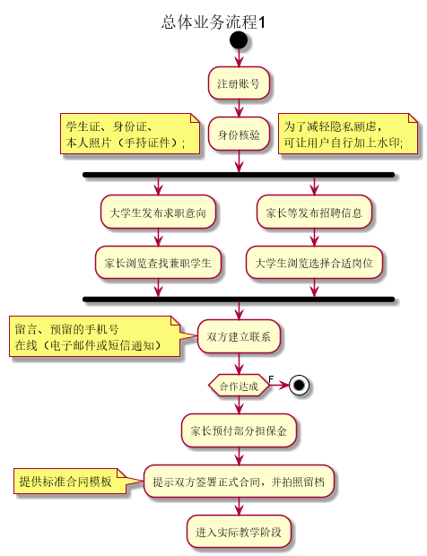
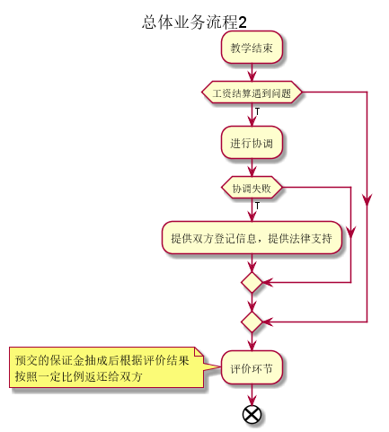

# 需求规约 大学生兼职平台
## 引言
### 目的
暂无描述

### 背景
暂无描述

### 参考资料
暂无描述

### 术语
暂无描述

## 任务概述
### 目标
暂无描述

## 需求规定
### 一般性需求
暂无描述

### 功能性需求
1. 角色说明

- 学生 发布求职信息、浏览岗位信息、与家长沟通、评价。
- 家长 发布岗位信息、浏览求职信息、沟通、评价。
- 管理员 审核资料、系统运行管理。

2. 基本业务流程

3. 功能列表

|功能名称|备注|裁剪说明|
|---|---|---|
|用户注册、登录|实现用户的注册和登录。|可部分裁剪|
|用户中心|供用户修改自己的信息，头像、年龄等，包括身份核验操作，核验通过后方可发布信息。|可部分裁剪|
|求职信息|大学生在此处发布求职信息，附带简要简历说明或者视频。|不可裁剪|
|招聘信息|家长在此处发布招聘信息，包括对职位详细说明。|不可裁剪|
|搜索|搜索求职信息或招聘信息|不可裁剪|
|在线交流|一方在浏览信息后，“联系对方”将用邮件或者短信通知对方，并根据设置公开联系方式或者提供在线聊天功能。|可完全裁剪|
|合作管理|在合作达成后，维护合作进度，引导打印合同，进行双方评价等。|不可裁剪|
|后台管理|管理员在登录后台后进行用户审核、用户管理、站点信息配置等。|可部分裁剪|
|权限管理|对系统使用者提供权限、角色管理，限制用户可访问的页面。|可部分裁剪|

#### 用户注册、登录
**需求描述**

||功能需求|
|---|---|
|功能名称|用户注册、登录|
|优先级|中|
|业务背景|用户注册后登录发布信息，同样管理员也需要登录进入后台管理。|
|功能说明|1. 用户注册  2. 用户登录  3. 验证码逻辑  4. 第三方平台登录|
|裁剪说明|可部分裁剪|

**数据描述**

*用户*

|名称|描述|是否必填|
|---|---|---|
|用户编号||是|
|用户名||是|
|密码||是|
|权限|1. 学生  2. 家长  3. 管理员|是|

#### 用户中心
**需求描述**

||功能需求|
|---|---|
|功能名称|用户中心|
|优先级|低|
|业务背景|用户登录后可以进入用户中心管理自己的信息。|
|功能说明|1. 修改用户信息  2. 提交身份审核  3. 进入发布信息的入口  4. 管理员用户提供进入后台管理的链接|
|裁剪说明|可部分裁剪|

**数据描述**

*用户信息*

|名称|描述|是否必填|
|---|---|---|
|用户信息编号||是|
|用户编号|与用户表对应|是|
|姓名||否|
|性别||否|
|出生日期||否|
|身份证号||否|
|头像||否|
|个人说明||否|
|审核材料||否|
|审核状态|1. 未审核  2. 已经审核|否|

#### 求职信息
**需求描述**

||功能需求|
|---|---|
|功能名称|求职信息|
|优先级|高|
|业务背景|大学生登陆后在此处发布并维护求职信息，已经审核过的信息会有标记。|
|功能说明|1. 发布求职信息 2. 修改求职信息 3. 查看留言并回复 4. 设置联系方式的展示方式  5. 申请审核/公证|
|裁剪说明|不可裁剪|

**数据描述**

*求职信息*

|名称|描述|是否必填|
|---|---|---|
|求职编号||是|
|发布时间||是|
|用户编号|与用户表对应|是|
|姓名||是|
|性别||是|
|学校||否|
|入学年份||否|
|专业||否|
|手机号||否|
|QQ号||否|
|邮箱||否|
|学科1|可以教的学科|否|
|学科2||否|
|学科3||否|
|预期薪资||否|
|个人介绍||否|
|是否已经审核||否|

#### 招聘信息
**需求描述**

||功能需求|
|---|---|
|功能名称|招聘信息|
|优先级|高|
|业务背景|家长/机构登陆后在此处发布并维护招聘信息，已经审核过的信息会有标记。|
|功能说明|1. 发布招聘信息 2. 修改招聘信息 3. 查看留言并回复 4. 设置联系方式的展示方式  5. 申请审核/公证|
|裁剪说明|不可裁剪|

**数据描述**

*招聘信息*

|名称|描述|是否必填|
|---|---|---|
|招聘编号||是|
|发布时间||是|
|用户编号|与用户表对应|是|
|姓名||是|
|性别||是|
|手机号||否|
|QQ号||否|
|邮箱||否|
|地址||是|
|薪资||否|
|具体描述||否|
|是否已经审核||否|

#### 搜索
**需求描述**

||功能需求|
|---|---|
|功能名称|搜索|
|优先级|高|
|业务背景|学生/家长/机构登陆后在此对已经发布的信息进行查看/筛选/搜索。|
|功能说明|1. 查看（筛选/排序）  2. 搜索  3. 达成合作|
|裁剪说明|不可裁剪|

#### 在线交流
**需求描述**

||功能需求|
|---|---|
|功能名称|在线交流|
|优先级|中|
|业务背景|在用户浏览求职/招聘信息后，通过留言/站内信等方式进行互动。|
|功能说明|1. 留言  2. 查看留言信息  3. 向其他用户发送站内信  4. 查看/删除站内信|
|裁剪说明|不可裁剪|

**数据描述**

*留言*

|名称|描述|是否必填|
|---|---|---|
|留言编号||是|
|留言时间||是|
|留言从属|字符串，留言从属于哪个页面|是|
|留言用户编号|对应用户编号|是|
|留言内容||是|

*站内信*

|名称|描述|是否必填|
|---|---|---|
|站内信编号||是|
|发送时间||是|
|发送者编号|对应用户编号|是|
|接受者编号||是|
|内容||是|

#### 合作管理
**需求描述**

||功能需求|
|---|---|
|功能名称|合作管理|
|优先级|高|
|业务背景|双方达成合作意向后，引导双方签订合同，管理进度。|
|功能说明|1. 家长预付保证金  2. 双方签订正式合同  3. 教学结束，结算  4.评价|
|裁剪说明|不可裁剪|

**数据描述**

*合作*

|名称|描述|是否必填|
|---|---|---|
|合作编号||是|
|学生编号||是|
|家长编号||是|
|保证金||是|
|正式合同||是|
|当前状态|1. 合作未开始  2. 已经签订正式合同  3. 教学已经结束  4. 评价完成|是|

#### 后台管理
略

#### 权限管理
略

## 系统安全性问题

## 运行环境规定

## 遗留问题

## 项目非技术需求
